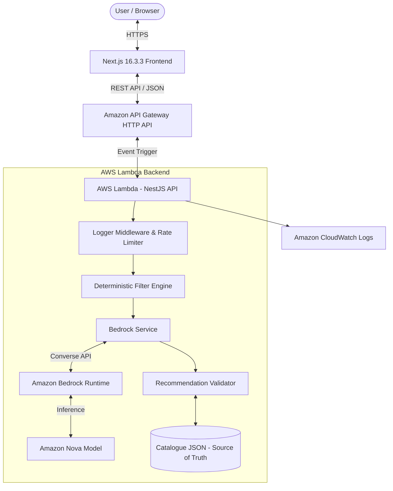

# StyleSeek AI 🛍️✨
> **AI-Powered Fashion Discovery Assistant** built with **Amazon Bedrock**, **Amazon Nova**, **AWS Lambda**, **Amazon API Gateway**, and **Next.js 16.3.3**.

---

## 📌 Overview
**StyleSeek AI** is a standalone, customer-facing AI fashion discovery web application. It helps users find suitable clothing products from an in-house fashion collection using natural language (e.g., *"Show me black T-shirts under LKR 3,000"*, *"Suggest an outfit for a birthday party"*).

---

## 🎯 Problem & Solution
- **Problem**: Traditional fashion ecommerce search relies on rigid keyword matching and manual multi-select filter menus, making discovery tedious and insensitive to natural language intent or occasion-based matching.
- **Solution**: StyleSeek AI combines **Amazon Nova** via the **Amazon Bedrock Converse API** with a deterministic backend rule engine. User prompts are filtered first by deterministic rules (e.g. max budget ceilings), then matched for intent and style by Amazon Nova, and finally strictly validated against real inventory before rendering recommendation cards.

---

## ✨ Features
- 💬 **Conversational AI Interface**: Interactive chat assistant supporting multi-turn follow-up conversations.
- 🛡️ **Zero AI Hallucinations**: Backend validates all product recommendations against the product catalogue source of truth. Fake or out-of-stock product IDs are automatically purged.
- 💵 **Deterministic Budget Enforcement**: Hard price ceilings ("under LKR 3,000") are enforced by NestJS application logic before and after AI inference.
- 🚀 **Serverless Architecture**: Built with NestJS wrapped in AWS Lambda (`@codegenie/serverless-express`), API Gateway, and CloudWatch.
- ⚡ **Rate & Burst Limiting**: Throttles requests both at the API Gateway HTTP API level and the NestJS application level.
- 🔒 **Prompt Injection Protection**: Server-side system prompt and strict DTO validation prevent credential leaks or system prompt exposures.

---

## 🏗️ Architecture


---

## ☁️ AWS Services Used
1. **Amazon Bedrock**: Provides secure runtime integration using AWS SDK v3 `ConverseCommand`.
2. **Amazon Nova**: Generative AI model that understands natural language fashion requests, intent, and style context.
3. **AWS Lambda**: Runs the serverless NestJS backend code without managing static infrastructure.
4. **Amazon API Gateway**: Managed HTTP API endpoint with route-level rate and burst throttling for `/api/assistant/recommend`.
5. **Amazon CloudWatch**: Captures logs, processing metrics, request IDs, and safe error tracebacks with a 14-day retention policy.

---

## 💻 Technology Stack
- **Frontend**: Next.js 16.3.3 (Active LTS), React 19, TypeScript, Tailwind CSS, Lucide Icons.
- **Backend**: NestJS 10, TypeScript, REST API, `class-validator`, `@aws-sdk/client-bedrock-runtime`, `@codegenie/serverless-express`.
- **Infrastructure**: AWS SAM (`template.yaml`), IAM Least-Privilege Policies.
- **Testing & Code Quality**: Jest, ESLint, TypeScript Strict Mode.

---

## 🚀 Local Development Setup

### 1. Prerequisites
- Node.js 20.x or 22.x LTS
- AWS CLI configured (for Bedrock access)

### 2. Installation
```bash
# Clone the repository
git clone https://github.com/PamudaUposath/styleseek-ai.git
cd styleseek-ai

# Install dependencies across all monorepo workspaces
npm install
```

### 3. Environment Configuration
Copy `.env.example` to `.env`:
```bash
cp .env.example .env
```
Ensure `.env` contains:
```env
NODE_ENV=development
PORT=3001
AWS_REGION=us-east-1
BEDROCK_MODEL_ID=us.amazon.nova-lite-v1:0
ALLOWED_ORIGINS=http://localhost:3000
NEXT_PUBLIC_API_BASE_URL=http://localhost:3001
```

### 4. Run Development Servers
```bash
# Run both Frontend (port 3000) and Backend API (port 3001) simultaneously
npm run dev
```

---

## 🧪 Testing & Code Quality
```bash
# Run unit tests
npm run test

# Run type check
npm run typecheck

# Run linting
npm run lint

# Build all packages
npm run build
```

---

## 🛠️ AWS SAM Deployment Guide

1. **Install AWS SAM CLI**: Make sure `sam` is installed.
2. **Check Bedrock Access**: Confirm Amazon Nova model access in your target AWS region (e.g. `us-east-1`).
3. **Build Infrastructure**:
   ```bash
   sam build -t infrastructure/template.yaml
   ```
4. **Deploy Guided**:
   ```bash
   sam deploy --guided
   ```
   Specify stack name (e.g. `styleseek-ai-prod`), select AWS Region, and set `BedrockModelId` parameter (e.g., `us.amazon.nova-lite-v1:0`).
5. **Set Frontend Base URL**: Update `NEXT_PUBLIC_API_BASE_URL` in `apps/web/.env.local` to point to the output API Gateway endpoint URL.

---

## 🔐 Security & Safety
- **No Client Credentials**: AWS SDK calls happen exclusively on the backend. No AWS access keys are sent to browser code.
- **Output Sanitization**: System prompt and environment variables are never exposed in user-facing messages.
- **Rate Limiting**: NestJS Throttler limits requests to 20/min locally, while API Gateway limits route burst to 5.
- **Timeout Protection**: 15-second application-level timeout on Bedrock calls guarantees responses finish before API Gateway's 30s ceiling.

---

## 📜 License
MIT License.
