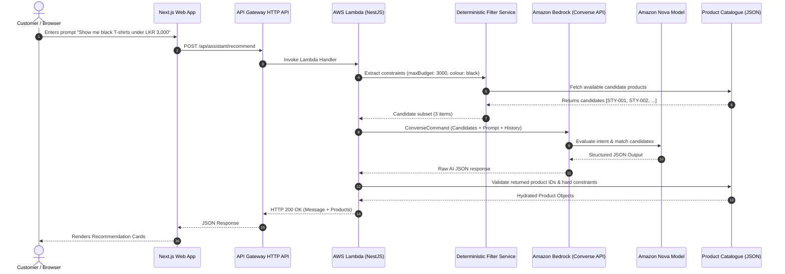

# StyleSeek AI Architectural Deep Dive

## 1. System Architecture Diagram

## 2. Component Design

### 2.1 Catalogue Module (Single Source of Truth)
- Located in `apps/api/src/catalogue/data/products.json`.
- Contains 30 realistic fashion items with Sri Lankan Rupees (LKR) pricing.
- Exposes `getAllProducts()`, `getProductById()`, `getAvailableProducts()`, and `isValidAvailableProduct()`.

### 2.2 Deterministic Filter Engine
- Runs before AI inference to parse hard numeric rules:
  - Budget regex extraction (`under LKR 3,000`, `below 4000`).
  - Colour extraction (`black`, `white`, `navy`, etc.).
  - Category matching (`T-Shirts`, `Hoodies`, `Jeans`).
- Purges any candidate items costing more than the max budget or out of stock.

### 2.3 Bedrock & Nova Integration
- Built with `@aws-sdk/client-bedrock-runtime` using `ConverseCommand`.
- Accepts multi-turn chat history (last 4 messages).
- Implements a 15-second `Promise.race` timeout to stay well within API Gateway's 30-second execution ceiling.

### 2.4 Response Validation & Sanitization
- Rejects any fake product IDs invented by the LLM.
- Verifies stock status (`IN_STOCK`).
- Verifies hard price ceilings.
- Limits output recommendations between 3 and 5 items.
